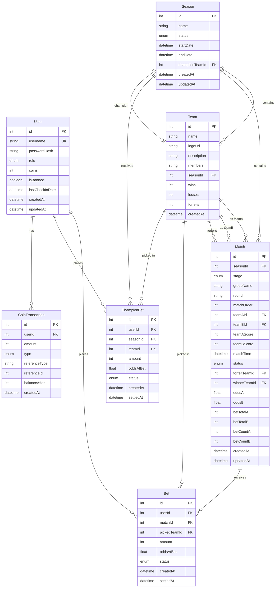
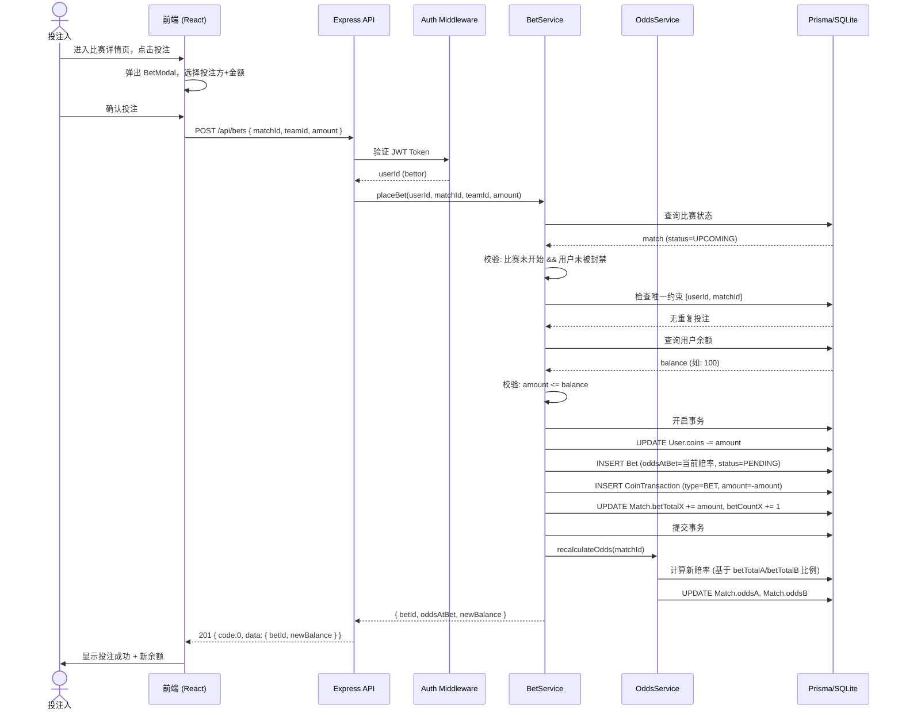
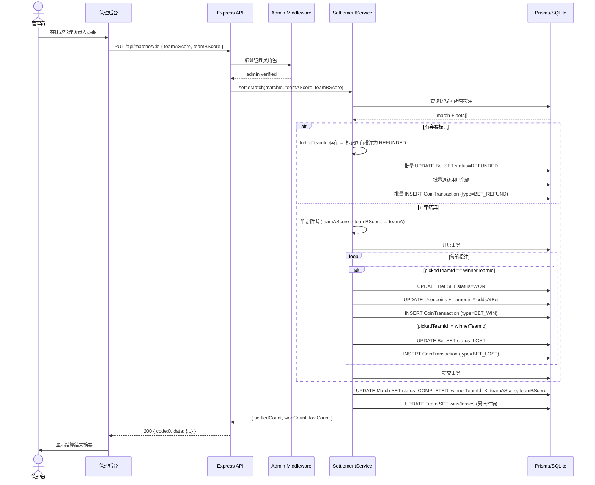
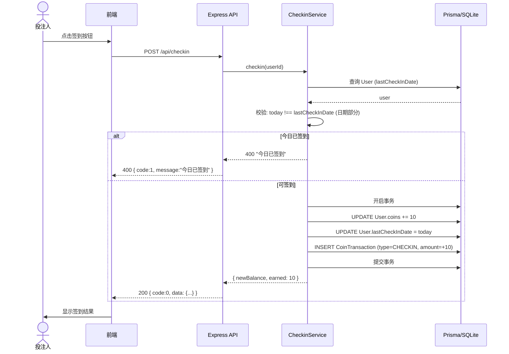
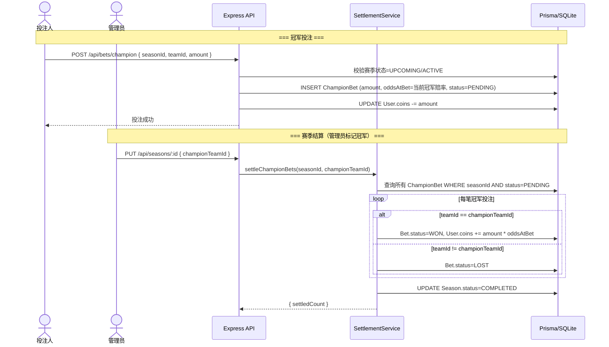
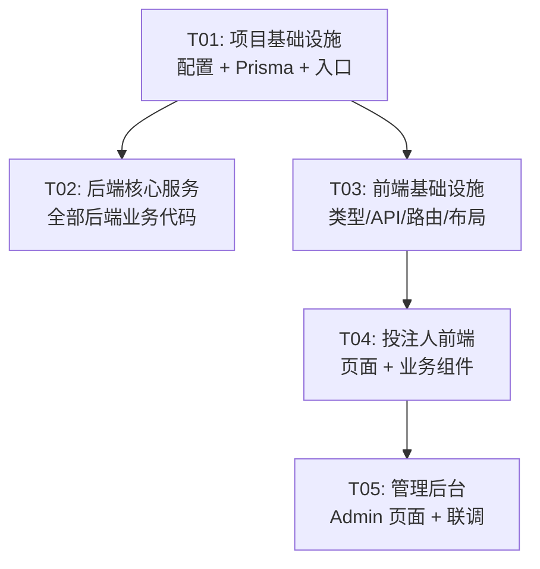

# 王者荣耀在线竞猜比赛平台 — 系统架构设计

> 项目代号：`wangzhe_betting`
> 架构师：Bob
> 日期：2025-01-20

---

## Part A: 系统设计

### 1. 实现方案与框架选型

#### 1.1 核心难点分析

| 难点 | 分析 | 策略 |
|------|------|------|
| **赔率动态计算** | 需根据投注分布实时调整赔率，范围 1.1~5.0 | 后端独立 OddsService，基于投注金额比例计算，管理员可手动覆写 |
| **结算一致性** | 比赛结算涉及批量更新投注状态、用户余额、流水记录，需保证原子性 | Prisma 事务 + 幂等设计（结算状态机：PENDING→WON/LOST/REFUNDED） |
| **淘汰赛树状图** | 需前端展示淘汰赛晋级树，数据需表达父子场次关系 | 利用 `round` + `matchOrder` 字段推断对阵关系，前端递归渲染 |
| **弃赛退款** | 标记弃赛后该场全部投注全额退款，余额回退 | SettlementService 统一处理，记录退款流水 |
| **并发安全** | 同一用户对同一比赛重复投注、超额投注 | 数据库唯一约束 (user+match)，投注时校验余额 |

#### 1.2 技术选型

| 层 | 选型 | 版本 | 理由 |
|-----|------|------|------|
| **前端框架** | React | ^18.3 | 生态成熟，与 MUI 配合最佳 |
| **构建工具** | Vite | ^6.0 | 极速 HMR，零配置 TypeScript 支持 |
| **UI 组件库** | MUI (Material UI) | ^6.1 | 完整组件体系，内置主题系统 |
| **样式方案** | Tailwind CSS | ^3.4 | 原子化样式，与 MUI 互补（布局用 Tailwind，组件用 MUI） |
| **路由** | React Router | ^7.0 | 官方推荐，支持布局路由和权限守卫 |
| **状态管理** | Zustand | ^5.0 | 轻量、无 boilerplate，适合中小型应用 |
| **HTTP 客户端** | Axios | ^1.7 | 拦截器支持，广泛使用 |
| **后端框架** | Express.js | ^4.21 | Node.js 生态标杆，中间件体系完善 |
| **ORM** | Prisma | ^6.0 | 类型安全、迁移工具内置、支持 SQLite/MySQL 切换 |
| **认证** | JWT (jsonwebtoken) | ^9.0 | 无状态认证，适合前后端分离 |
| **密码加密** | bcryptjs | ^2.4 | 纯 JS 实现，跨平台无编译问题 |
| **输入校验** | Zod | ^3.24 | 类型推导 + 运行时校验，前后端共享 schema |
| **数据库** | SQLite（默认） | — | 零配置，通过 Prisma 可无缝切换 MySQL |

#### 1.3 架构模式

```
┌──────────────────────────────────────────────────────┐
│                    前端 (Vite + React)                 │
│  ┌──────────┐ ┌──────────┐ ┌────────┐ ┌───────────┐ │
│  │  Pages/   │ │Components│ │ Store  │ │  API      │ │
│  │  Routes   │ │  (MUI)   │ │(Zustand)│ │ Client    │ │
│  └──────────┘ └──────────┘ └────────┘ └───────────┘ │
├──────────────────────────────────────────────────────┤
│                  HTTP REST API (JSON)                 │
├──────────────────────────────────────────────────────┤
│                  后端 (Express.js)                     │
│  ┌──────────┐ ┌──────────┐ ┌────────┐ ┌───────────┐ │
│  │  Routes   │ │Controllers│ │Services│ │Middleware  │ │
│  │(thin)    │ │(validate)│ │(logic) │ │(auth/err) │ │
│  └──────────┘ └──────────┘ └────────┘ └───────────┘ │
│                      ↕ Prisma ORM                     │
│                 ┌─────────────────┐                   │
│                 │  SQLite / MySQL  │                   │
│                 └─────────────────┘                   │
└──────────────────────────────────────────────────────┘
```

**三层分离**：
- **Routes**：仅负责路由注册和 HTTP 层面的请求/响应处理
- **Controllers**：参数校验、调用 Service、格式化响应
- **Services**：全部业务逻辑，可独立测试

---

### 2. 文件列表

#### 2.1 前端文件 (`frontend/`)

```
frontend/
├── index.html
├── package.json
├── vite.config.ts
├── tsconfig.json
├── tsconfig.node.json
├── tailwind.config.ts
├── postcss.config.js
├── src/
│   ├── main.tsx                          # 应用入口
│   ├── App.tsx                           # 根组件（路由挂载）
│   ├── vite-env.d.ts                     # Vite 类型声明
│   │
│   ├── types/
│   │   └── index.ts                      # 全局 TypeScript 类型定义
│   │
│   ├── utils/
│   │   ├── format.ts                     # 日期/金额/状态格式化
│   │   └── constants.ts                  # 前端常量（投注限额、状态枚举）
│   │
│   ├── store/
│   │   ├── authStore.ts                  # 认证状态（Zustand）
│   │   └── appStore.ts                   # 全局 UI 状态
│   │
│   ├── hooks/
│   │   ├── useAuth.ts                    # 认证相关 hook
│   │   └── useApi.ts                     # 通用 API 调用 hook（loading/error）
│   │
│   ├── api/
│   │   ├── client.ts                     # Axios 实例 + JWT 拦截器
│   │   ├── auth.ts                       # 登录/注册 API
│   │   ├── checkin.ts                    # 签到 API
│   │   ├── matches.ts                    # 比赛 API
│   │   ├── teams.ts                      # 战队 API
│   │   ├── seasons.ts                    # 赛季 API
│   │   ├── bets.ts                       # 投注 API
│   │   ├── leaderboard.ts                # 排行榜 API
│   │   └── admin.ts                      # 管理后台 API
│   │
│   ├── components/
│   │   ├── layout/
│   │   │   ├── Navbar.tsx                # 顶部导航栏
│   │   │   ├── Footer.tsx                # 底部信息栏
│   │   │   ├── GuestLayout.tsx           # 未登录布局
│   │   │   ├── BettorLayout.tsx          # 投注人布局
│   │   │   └── AdminLayout.tsx           # 管理后台布局
│   │   ├── common/
│   │   │   ├── Loading.tsx               # 加载状态
│   │   │   ├── ErrorAlert.tsx            # 错误提示
│   │   │   ├── EmptyState.tsx            # 空状态
│   │   │   ├── PageHeader.tsx            # 页面标题组件
│   │   │   ├── ConfirmDialog.tsx         # 确认弹窗
│   │   │   └── CoinDisplay.tsx           # 投注币展示
│   │   ├── match/
│   │   │   ├── MatchCard.tsx             # 比赛卡片
│   │   │   ├── MatchList.tsx             # 比赛列表
│   │   │   ├── MatchFilter.tsx           # 比赛筛选栏
│   │   │   ├── BracketView.tsx           # 淘汰赛树状图
│   │   │   └── BracketNode.tsx           # 淘汰赛节点
│   │   ├── bet/
│   │   │   ├── BetModal.tsx              # 投注弹窗
│   │   │   ├── BetForm.tsx               # 投注表单
│   │   │   ├── BetHistory.tsx            # 投注记录列表
│   │   │   ├── ChampionBetCard.tsx       # 冠军投注卡片
│   │   │   └── OddsDisplay.tsx           # 赔率展示
│   │   ├── team/
│   │   │   ├── TeamCard.tsx              # 战队卡片
│   │   │   └── TeamRecord.tsx            # 战队历史战绩
│   │   ├── leaderboard/
│   │   │   ├── UserRankTable.tsx         # 用户排行榜表格
│   │   │   └── TeamRankTable.tsx         # 战队排行榜表格
│   │   └── admin/
│   │       ├── SeasonFormDialog.tsx      # 赛季表单弹窗
│   │       ├── TeamFormDialog.tsx        # 战队表单弹窗
│   │       ├── MatchFormDialog.tsx       # 比赛结果录入弹窗
│   │       ├── MatchGenerateDialog.tsx   # 赛程生成弹窗
│   │       ├── OddsAdjustDialog.tsx      # 赔率调整弹窗
│   │       ├── AdminStatCard.tsx         # 统计卡片
│   │       └── UserTable.tsx             # 用户管理表格
│   │
│   ├── pages/
│   │   ├── Home.tsx                      # 首页（比赛预告+排行榜预览）
│   │   ├── Login.tsx                     # 登录页
│   │   ├── Register.tsx                  # 注册页
│   │   ├── Profile.tsx                   # 个人信息页
│   │   ├── Matches.tsx                   # 比赛列表页
│   │   ├── MatchDetail.tsx               # 比赛详情页
│   │   ├── Teams.tsx                     # 战队列表页
│   │   ├── TeamDetail.tsx                # 战队详情页
│   │   ├── Leaderboard.tsx               # 排行榜页
│   │   ├── MyBets.tsx                    # 我的投注记录
│   │   ├── ChampionBet.tsx               # 冠军投注页
│   │   └── admin/
│   │       ├── Dashboard.tsx             # 管理后台首页看板
│   │       ├── SeasonManage.tsx          # 赛季管理
│   │       ├── TeamManage.tsx            # 战队管理
│   │       ├── MatchManage.tsx           # 比赛管理
│   │       ├── OddsManage.tsx            # 赔率管理
│   │       └── UserManage.tsx            # 用户管理
│   │
│   └── routes/
│       └── index.tsx                     # 路由配置（含权限守卫）
```

#### 2.2 后端文件 (`backend/`)

```
backend/
├── package.json
├── tsconfig.json
├── nodemon.json
├── prisma/
│   ├── schema.prisma                     # 数据库 Schema
│   └── seed.ts                           # 种子数据（管理员账号 + 示例数据）
├── src/
│   ├── index.ts                          # 服务入口（启动监听）
│   ├── app.ts                            # Express 应用装配
│   │
│   ├── config/
│   │   └── index.ts                      # 环境变量配置（PORT, JWT_SECRET, DATABASE_URL）
│   │
│   ├── types/
│   │   └── index.ts                      # 后端类型定义（DTO, 响应格式）
│   │
│   ├── utils/
│   │   ├── jwt.ts                        # JWT 签发/验证
│   │   ├── password.ts                   # 密码哈希/比对
│   │   ├── response.ts                  # 统一响应格式
│   │   └── constants.ts                  # 后端常量（初始币数、签到奖励、赔率范围等）
│   │
│   ├── middleware/
│   │   ├── auth.ts                       # JWT 认证中间件（required + optional）
│   │   ├── admin.ts                      # 管理员角色校验
│   │   └── errorHandler.ts              # 全局错误处理中间件
│   │
│   ├── routes/
│   │   ├── index.ts                      # 路由汇总注册
│   │   ├── auth.routes.ts                # 认证路由
│   │   ├── checkin.routes.ts            # 签到路由
│   │   ├── users.routes.ts              # 用户路由
│   │   ├── seasons.routes.ts            # 赛季路由
│   │   ├── teams.routes.ts              # 战队路由
│   │   ├── matches.routes.ts            # 比赛路由
│   │   ├── bets.routes.ts               # 投注路由
│   │   ├── odds.routes.ts               # 赔率路由
│   │   ├── leaderboard.routes.ts        # 排行榜路由
│   │   └── admin.routes.ts              # 管理后台路由
│   │
│   ├── controllers/
│   │   ├── auth.controller.ts
│   │   ├── checkin.controller.ts
│   │   ├── users.controller.ts
│   │   ├── seasons.controller.ts
│   │   ├── teams.controller.ts
│   │   ├── matches.controller.ts
│   │   ├── bets.controller.ts
│   │   ├── odds.controller.ts
│   │   ├── leaderboard.controller.ts
│   │   └── admin.controller.ts
│   │
│   └── services/
│       ├── auth.service.ts               # 登录注册逻辑
│       ├── checkin.service.ts            # 签到逻辑
│       ├── users.service.ts              # 用户查询/更新
│       ├── seasons.service.ts            # 赛季 CRUD
│       ├── teams.service.ts              # 战队 CRUD
│       ├── matches.service.ts            # 比赛 CRUD + 赛程生成
│       ├── bets.service.ts               # 投注业务（校验、下注、退款）
│       ├── odds.service.ts               # 赔率动态计算
│       ├── leaderboard.service.ts        # 排行榜查询
│       ├── settlement.service.ts         # 结算引擎（核心）
│       └── admin.service.ts              # 管理后台聚合查询
```

---

### 3. 数据模型设计

#### 3.1 数据库表结构

##### User（用户）

| 字段 | 类型 | 约束 | 说明 |
|------|------|------|------|
| id | Int | PK, AUTO_INCREMENT | 主键 |
| username | String | UNIQUE, NOT NULL | 用户名 |
| passwordHash | String | NOT NULL | bcrypt 哈希 |
| role | Enum(ADMIN, BETTOR) | NOT NULL, DEFAULT BETTOR | 角色 |
| coins | Int | NOT NULL, DEFAULT 100 | 投注币余额 |
| isBanned | Boolean | NOT NULL, DEFAULT false | 是否封禁 |
| lastCheckInDate | DateTime | NULLABLE | 上次签到日期 |
| createdAt | DateTime | NOT NULL, DEFAULT NOW | 创建时间 |
| updatedAt | DateTime | NOT NULL, @updatedAt | 更新时间 |

##### Season（赛季）

| 字段 | 类型 | 约束 | 说明 |
|------|------|------|------|
| id | Int | PK, AUTO_INCREMENT | 主键 |
| name | String | NOT NULL | 赛季名称，如"S1 春季赛" |
| status | Enum(UPCOMING, ACTIVE, COMPLETED) | NOT NULL, DEFAULT UPCOMING | 赛季状态 |
| startDate | DateTime | NOT NULL | 开始日期 |
| endDate | DateTime | NOT NULL | 结束日期 |
| championTeamId | Int | FK → Team.id, NULLABLE | 冠军战队（赛季结束后设置） |
| createdAt | DateTime | NOT NULL | 创建时间 |
| updatedAt | DateTime | NOT NULL | 更新时间 |

##### Team（战队）

| 字段 | 类型 | 约束 | 说明 |
|------|------|------|------|
| id | Int | PK, AUTO_INCREMENT | 主键 |
| name | String | NOT NULL | 战队名称 |
| logoUrl | String | NULLABLE | Logo 图片 URL |
| description | String | NULLABLE | 战队简介 |
| members | String | NULLABLE | 队员信息（JSON 字符串，仅展示） |
| seasonId | Int | FK → Season.id, NOT NULL | 所属赛季 |
| wins | Int | NOT NULL, DEFAULT 0 | 胜场数（冗余，结算时更新） |
| losses | Int | NOT NULL, DEFAULT 0 | 负场数（冗余，结算时更新） |
| forfeits | Int | NOT NULL, DEFAULT 0 | 对手弃赛胜场数 |
| createdAt | DateTime | NOT NULL | 创建时间 |

##### Match（比赛）

| 字段 | 类型 | 约束 | 说明 |
|------|------|------|------|
| id | Int | PK, AUTO_INCREMENT | 主键 |
| seasonId | Int | FK → Season.id, NOT NULL | 所属赛季 |
| stage | Enum(GROUP, KNOCKOUT) | NOT NULL | 阶段：小组赛/淘汰赛 |
| groupName | String | NULLABLE | 小组名，如"A组"（小组赛时有值） |
| round | String | NULLABLE | 轮次，如"1/4决赛"（淘汰赛时有值） |
| matchOrder | Int | NULLABLE | 淘汰赛对阵序号（0-based，推断晋级路径） |
| teamAId | Int | FK → Team.id, NOT NULL | 战队A |
| teamBId | Int | FK → Team.id, NOT NULL | 战队B |
| teamAScore | Int | NULLABLE | 战队A得分 |
| teamBScore | Int | NULLABLE | 战队B得分 |
| matchTime | DateTime | NOT NULL | 比赛时间 |
| status | Enum(UPCOMING, LIVE, COMPLETED, FORFEITED) | NOT NULL, DEFAULT UPCOMING | 比赛状态 |
| forfeitTeamId | Int | FK → Team.id, NULLABLE | 弃赛战队 ID |
| winnerTeamId | Int | FK → Team.id, NULLABLE | 胜者战队 ID |
| oddsA | Float | NOT NULL, DEFAULT 1.5 | 战队A赔率 |
| oddsB | Float | NOT NULL, DEFAULT 1.5 | 战队B赔率 |
| betTotalA | Int | NOT NULL, DEFAULT 0 | 投注A方总额 |
| betTotalB | Int | NOT NULL, DEFAULT 0 | 投注B方总额 |
| betCountA | Int | NOT NULL, DEFAULT 0 | 投注A方人数 |
| betCountB | Int | NOT NULL, DEFAULT 0 | 投注B方人数 |
| createdAt | DateTime | NOT NULL | 创建时间 |
| updatedAt | DateTime | NOT NULL | 更新时间 |

##### Bet（投注）

| 字段 | 类型 | 约束 | 说明 |
|------|------|------|------|
| id | Int | PK, AUTO_INCREMENT | 主键 |
| userId | Int | FK → User.id, NOT NULL | 投注用户 |
| matchId | Int | FK → Match.id, NOT NULL | 投注比赛 |
| pickedTeamId | Int | FK → Team.id, NOT NULL | 投注选择的战队 |
| amount | Int | NOT NULL | 投注金额 |
| oddsAtBet | Float | NOT NULL | 投注时锁定赔率 |
| status | Enum(PENDING, WON, LOST, REFUNDED) | NOT NULL, DEFAULT PENDING | 投注状态 |
| createdAt | DateTime | NOT NULL | 投注时间 |
| settledAt | DateTime | NULLABLE | 结算时间 |

**唯一约束**: `@@unique([userId, matchId])` — 同一用户对同一比赛只能投注一次

##### ChampionBet（冠军投注）

| 字段 | 类型 | 约束 | 说明 |
|------|------|------|------|
| id | Int | PK, AUTO_INCREMENT | 主键 |
| userId | Int | FK → User.id, NOT NULL | 投注用户 |
| seasonId | Int | FK → Season.id, NOT NULL | 所属赛季 |
| teamId | Int | FK → Team.id, NOT NULL | 投注的冠军战队 |
| amount | Int | NOT NULL | 投注金额 |
| oddsAtBet | Float | NOT NULL | 投注时锁定赔率 |
| status | Enum(PENDING, WON, LOST, REFUNDED) | NOT NULL, DEFAULT PENDING | 投注状态 |
| createdAt | DateTime | NOT NULL | 投注时间 |
| settledAt | DateTime | NULLABLE | 结算时间 |

**唯一约束**: `@@unique([userId, seasonId])` — 同一用户每赛季只能投一次冠军

##### CoinTransaction（币流水）

| 字段 | 类型 | 约束 | 说明 |
|------|------|------|------|
| id | Int | PK, AUTO_INCREMENT | 主键 |
| userId | Int | FK → User.id, NOT NULL | 用户 |
| amount | Int | NOT NULL | 变动金额（正=入账，负=出账） |
| type | Enum(INITIAL, CHECKIN, BET, BET_WIN, BET_LOST, BET_REFUND, CHAMPION_BET, CHAMPION_WIN, CHAMPION_LOST, CHAMPION_REFUND, ADMIN_ADJUST) | NOT NULL | 交易类型 |
| referenceType | String | NULLABLE | 关联类型（"bet" / "champion_bet"） |
| referenceId | Int | NULLABLE | 关联记录 ID |
| balanceAfter | Int | NOT NULL | 交易后余额 |
| createdAt | DateTime | NOT NULL | 交易时间 |

#### 3.2 Mermaid ER 图



#### 3.3 Prisma Schema 关键枚举

```prisma
enum Role { ADMIN BETTOR }
enum SeasonStatus { UPCOMING ACTIVE COMPLETED }
enum MatchStage { GROUP KNOCKOUT }
enum MatchStatus { UPCOMING LIVE COMPLETED FORFEITED }
enum BetStatus { PENDING WON LOST REFUNDED }
enum TransactionType {
  INITIAL CHECKIN
  BET BET_WIN BET_LOST BET_REFUND
  CHAMPION_BET CHAMPION_WIN CHAMPION_LOST CHAMPION_REFUND
  ADMIN_ADJUST
}
```

---

### 4. 程序调用流程

#### 4.1 用户投注流程



#### 4.2 比赛结算流程（核心）



#### 4.3 每日签到流程



#### 4.4 冠军投注 + 赛季结算流程



---

### 5. API 路由设计

#### 5.1 通用约定

- **Base URL**: `/api`
- **响应格式**: `{ code: 0 | 1, data?: any, message?: string }`
  - `code: 0` 成功，`code: 1` 失败
- **认证方式**: Header `Authorization: Bearer <JWT>`
- **权限标记**: 🔓 公开 | 🔒 需登录 | 👑 仅管理员

#### 5.2 认证模块

| 方法 | 路径 | 权限 | 说明 |
|------|------|------|------|
| POST | /api/auth/register | 🔓 | 注册 { username, password } → { token, user } |
| POST | /api/auth/login | 🔓 | 登录 { username, password } → { token, user } |
| GET | /api/auth/me | 🔒 | 获取当前用户信息 → user |

#### 5.3 签到模块

| 方法 | 路径 | 权限 | 说明 |
|------|------|------|------|
| POST | /api/checkin | 🔒 | 每日签到 → { earned, newBalance } |

#### 5.4 用户模块

| 方法 | 路径 | 权限 | 说明 |
|------|------|------|------|
| GET | /api/users/me | 🔒 | 获取个人信息（含余额、签到状态） |
| PUT | /api/users/me | 🔒 | 更新个人信息 { password? } |
| GET | /api/users/:id | 🔒 | 获取用户公开信息（排行榜跳转） |

#### 5.5 赛季模块

| 方法 | 路径 | 权限 | 说明 |
|------|------|------|------|
| GET | /api/seasons | 🔓 | 赛季列表，支持 ?status= 筛选 |
| GET | /api/seasons/:id | 🔓 | 赛季详情（含参赛队伍列表） |
| POST | /api/seasons | 👑 | 创建赛季 { name, startDate, endDate } |
| PUT | /api/seasons/:id | 👑 | 编辑赛季 |
| PUT | /api/seasons/:id/champion | 👑 | 设置冠军 { championTeamId }（触发结算） |

#### 5.6 战队模块

| 方法 | 路径 | 权限 | 说明 |
|------|------|------|------|
| GET | /api/teams | 🔓 | 战队列表，支持 ?seasonId=&keyword= |
| GET | /api/teams/:id | 🔓 | 战队详情（含成员、历史战绩、统计） |
| POST | /api/teams | 👑 | 创建战队 { name, logoUrl?, description?, members?, seasonId } |
| PUT | /api/teams/:id | 👑 | 编辑战队 |
| DELETE | /api/teams/:id | 👑 | 删除战队（仅当无关联比赛时） |

#### 5.7 比赛模块

| 方法 | 路径 | 权限 | 说明 |
|------|------|------|------|
| GET | /api/matches | 🔓 | 比赛列表，支持 ?seasonId=&stage=&status=&groupId= |
| GET | /api/matches/:id | 🔓 | 比赛详情（含两队信息+赔率+投注统计） |
| POST | /api/matches/generate | 👑 | 生成赛程 { seasonId, groups[], knockoutRounds } |
| PUT | /api/matches/:id | 👑 | 录入/修改赛果 { teamAScore, teamBScore }（触发结算） |
| PUT | /api/matches/:id/forfeit | 👑 | 标记弃赛 { forfeitTeamId }（触发全额退款） |

#### 5.8 投注模块

| 方法 | 路径 | 权限 | 说明 |
|------|------|------|------|
| POST | /api/bets | 🔒 | 投注比赛 { matchId, teamId, amount } |
| GET | /api/bets/mine | 🔒 | 我的投注记录，支持 ?status=&seasonId= |
| POST | /api/bets/champion | 🔒 | 冠军投注 { seasonId, teamId, amount } |
| GET | /api/bets/champion/mine | 🔒 | 我的冠军投注记录 |

#### 5.9 赔率模块

| 方法 | 路径 | 权限 | 说明 |
|------|------|------|------|
| GET | /api/odds/:matchId | 🔓 | 查看比赛赔率 |
| PUT | /api/odds/:matchId | 👑 | 手动调整赔率 { oddsA?, oddsB? } |

#### 5.10 排行榜模块

| 方法 | 路径 | 权限 | 说明 |
|------|------|------|------|
| GET | /api/leaderboard/users | 🔓 | 用户排行榜，支持 ?seasonId=&limit= |
| GET | /api/leaderboard/teams | 🔓 | 战队排行榜，支持 ?seasonId=&limit= |

#### 5.11 管理后台模块

| 方法 | 路径 | 权限 | 说明 |
|------|------|------|------|
| GET | /api/admin/dashboard | 👑 | 数据看板（总用户/投注数/交易额等统计） |
| GET | /api/admin/users | 👑 | 用户列表，支持 ?keyword=&isBanned=&page=&limit= |
| PUT | /api/admin/users/:id/ban | 👑 | 封禁用户 |
| PUT | /api/admin/users/:id/unban | 👑 | 解封用户 |
| PUT | /api/admin/users/:id/coins | 👑 | 调整用户余额 { amount, reason } |

---

### 6. 不确定性说明

| 编号 | 事项 | 假设/决策 | 影响 |
|------|------|-----------|------|
| U1 | **冠军赔率计算** | 冠军赔率固定为各队投注总额反比，初始统一 2.0 | 可在 OddsService 中独立调整 |
| U2 | **淘汰赛赛程生成算法** | 小组赛出线后管理员手动指定淘汰赛对阵，不自动 | 简化实现，后续可增强 |
| U3 | **赛季中队伍变更** | 赛季开始后不允许增删队伍 | 保证数据一致性 |
| U4 | **前端路由权限** | 前端路由层和 API 层双重校验权限 | API 层为主，路由层仅 UI 隐藏 |
| U5 | **图片上传** | 战队 Logo 使用外部 URL 输入，不做文件上传 | 简化 MVP，后续可加 |
| U6 | **JWT 过期策略** | Access Token 7 天过期，无 Refresh Token | MVP 简化，后续可加 |
| U7 | **分页策略** | 列表接口默认 page=1&limit=20 | 统一约定 |

---

## Part B: 任务分解

### 7. 依赖包列表

#### 7.1 前端 (`frontend/package.json`)

```
- react@^18.3.1: UI 框架
- react-dom@^18.3.1: React DOM 渲染
- react-router-dom@^7.0.0: 前端路由
- @mui/material@^6.1.0: MUI 组件库
- @mui/icons-material@^6.1.0: MUI 图标库
- @emotion/react@^11.13.0: MUI 依赖
- @emotion/styled@^11.13.0: MUI 依赖
- axios@^1.7.0: HTTP 客户端
- zustand@^5.0.0: 状态管理
- tailwindcss@^3.4.0: 原子化 CSS
- autoprefixer@^10.4.0: PostCSS 插件
- postcss@^8.4.0: CSS 后处理器
- @types/react@^18.3.0: React 类型
- @types/react-dom@^18.3.0: React DOM 类型
- typescript@^5.6.0: TypeScript 编译器
- vite@^6.0.0: 构建工具
- @vitejs/plugin-react@^4.3.0: Vite React 插件
```

#### 7.2 后端 (`backend/package.json`)

```
- express@^4.21.0: Web 框架
- @prisma/client@^6.0.0: Prisma ORM 客户端
- prisma@^6.0.0: Prisma CLI（devDependency）
- jsonwebtoken@^9.0.0: JWT 签发/验证
- bcryptjs@^2.4.0: 密码哈希
- cors@^2.8.0: 跨域支持
- zod@^3.24.0: 输入校验
- @types/express@^5.0.0: Express 类型
- @types/jsonwebtoken@^9.0.0: JWT 类型
- @types/bcryptjs@^2.4.0: bcrypt 类型
- @types/cors@^2.8.0: CORS 类型
- typescript@^5.6.0: TypeScript 编译器
- tsx@^4.19.0: TypeScript 执行器（开发）
- nodemon@^3.1.0: 热重载（开发）
```

---

### 8. 任务列表

#### T01: 项目基础设施搭建

| 属性 | 内容 |
|------|------|
| **目标** | 初始化前后端项目骨架、配置文件、数据库 Schema、依赖声明 |
| **源文件** | |
| | `frontend/package.json` |
| | `frontend/vite.config.ts` |
| | `frontend/tsconfig.json` |
| | `frontend/tsconfig.node.json` |
| | `frontend/tailwind.config.ts` |
| | `frontend/postcss.config.js` |
| | `frontend/index.html` |
| | `frontend/src/main.tsx` |
| | `frontend/src/App.tsx` |
| | `frontend/src/vite-env.d.ts` |
| | `backend/package.json` |
| | `backend/tsconfig.json` |
| | `backend/nodemon.json` |
| | `backend/prisma/schema.prisma` |
| | `backend/prisma/seed.ts` |
| | `backend/src/index.ts` |
| | `backend/src/app.ts` |
| | `backend/src/config/index.ts` |
| **依赖** | 无 |
| **优先级** | P0 |

#### T02: 后端核心服务

| 属性 | 内容 |
|------|------|
| **目标** | 实现所有后端业务代码：认证、签到、赛季、战队、比赛、投注、赔率、结算、排行榜、管理后台 |
| **源文件** | |
| | `backend/src/types/index.ts` |
| | `backend/src/utils/jwt.ts` |
| | `backend/src/utils/password.ts` |
| | `backend/src/utils/response.ts` |
| | `backend/src/utils/constants.ts` |
| | `backend/src/middleware/auth.ts` |
| | `backend/src/middleware/admin.ts` |
| | `backend/src/middleware/errorHandler.ts` |
| | `backend/src/routes/index.ts` |
| | `backend/src/routes/auth.routes.ts` |
| | `backend/src/routes/checkin.routes.ts` |
| | `backend/src/routes/users.routes.ts` |
| | `backend/src/routes/seasons.routes.ts` |
| | `backend/src/routes/teams.routes.ts` |
| | `backend/src/routes/matches.routes.ts` |
| | `backend/src/routes/bets.routes.ts` |
| | `backend/src/routes/odds.routes.ts` |
| | `backend/src/routes/leaderboard.routes.ts` |
| | `backend/src/routes/admin.routes.ts` |
| | `backend/src/controllers/*.ts` (10 个文件) |
| | `backend/src/services/*.ts` (11 个文件) |
| **依赖** | T01（Prisma Schema 定义完成） |
| **优先级** | P0 |

#### T03: 前端基础设施 + 类型/工具/API 层

| 属性 | 内容 |
|------|------|
| **目标** | 搭建前端核心基础设施：类型定义、工具函数、状态管理、API 客户端、路由配置、布局组件 |
| **源文件** | |
| | `frontend/src/types/index.ts` |
| | `frontend/src/utils/format.ts` |
| | `frontend/src/utils/constants.ts` |
| | `frontend/src/store/authStore.ts` |
| | `frontend/src/store/appStore.ts` |
| | `frontend/src/hooks/useAuth.ts` |
| | `frontend/src/hooks/useApi.ts` |
| | `frontend/src/api/client.ts` |
| | `frontend/src/api/auth.ts` |
| | `frontend/src/api/checkin.ts` |
| | `frontend/src/api/matches.ts` |
| | `frontend/src/api/teams.ts` |
| | `frontend/src/api/seasons.ts` |
| | `frontend/src/api/bets.ts` |
| | `frontend/src/api/leaderboard.ts` |
| | `frontend/src/api/admin.ts` |
| | `frontend/src/routes/index.tsx` |
| | `frontend/src/components/layout/Navbar.tsx` |
| | `frontend/src/components/layout/Footer.tsx` |
| | `frontend/src/components/layout/GuestLayout.tsx` |
| | `frontend/src/components/layout/BettorLayout.tsx` |
| | `frontend/src/components/layout/AdminLayout.tsx` |
| | `frontend/src/components/common/*.tsx` (6 个公共组件) |
| **依赖** | T01（前端项目骨架可用） |
| **优先级** | P0 |

#### T04: 前端投注人所有页面 + 业务组件

| 属性 | 内容 |
|------|------|
| **目标** | 实现投注人可见的所有页面和业务组件：首页、认证、比赛、投注、战队、排行榜、个人中心 |
| **源文件** | |
| | `frontend/src/components/match/MatchCard.tsx` |
| | `frontend/src/components/match/MatchList.tsx` |
| | `frontend/src/components/match/MatchFilter.tsx` |
| | `frontend/src/components/match/BracketView.tsx` |
| | `frontend/src/components/match/BracketNode.tsx` |
| | `frontend/src/components/bet/BetModal.tsx` |
| | `frontend/src/components/bet/BetForm.tsx` |
| | `frontend/src/components/bet/BetHistory.tsx` |
| | `frontend/src/components/bet/ChampionBetCard.tsx` |
| | `frontend/src/components/bet/OddsDisplay.tsx` |
| | `frontend/src/components/team/TeamCard.tsx` |
| | `frontend/src/components/team/TeamRecord.tsx` |
| | `frontend/src/components/leaderboard/UserRankTable.tsx` |
| | `frontend/src/components/leaderboard/TeamRankTable.tsx` |
| | `frontend/src/pages/Home.tsx` |
| | `frontend/src/pages/Login.tsx` |
| | `frontend/src/pages/Register.tsx` |
| | `frontend/src/pages/Profile.tsx` |
| | `frontend/src/pages/Matches.tsx` |
| | `frontend/src/pages/MatchDetail.tsx` |
| | `frontend/src/pages/Teams.tsx` |
| | `frontend/src/pages/TeamDetail.tsx` |
| | `frontend/src/pages/Leaderboard.tsx` |
| | `frontend/src/pages/MyBets.tsx` |
| | `frontend/src/pages/ChampionBet.tsx` |
| **依赖** | T03（类型、API、路由、布局就绪） |
| **优先级** | P0 |

#### T05: 前端管理后台 + 整体集成调试

| 属性 | 内容 |
|------|------|
| **目标** | 实现管理后台全部页面和组件，完成前后端联调、路由守卫、整体验证 |
| **源文件** | |
| | `frontend/src/components/admin/SeasonFormDialog.tsx` |
| | `frontend/src/components/admin/TeamFormDialog.tsx` |
| | `frontend/src/components/admin/MatchFormDialog.tsx` |
| | `frontend/src/components/admin/MatchGenerateDialog.tsx` |
| | `frontend/src/components/admin/OddsAdjustDialog.tsx` |
| | `frontend/src/components/admin/AdminStatCard.tsx` |
| | `frontend/src/components/admin/UserTable.tsx` |
| | `frontend/src/pages/admin/Dashboard.tsx` |
| | `frontend/src/pages/admin/SeasonManage.tsx` |
| | `frontend/src/pages/admin/TeamManage.tsx` |
| | `frontend/src/pages/admin/MatchManage.tsx` |
| | `frontend/src/pages/admin/OddsManage.tsx` |
| | `frontend/src/pages/admin/UserManage.tsx` |
| **依赖** | T04（可并行开发，API 层已在 T03 定义） |
| **优先级** | P1 |

---

### 9. 任务依赖图



**并行建议**：T02 和 T03 可完全并行开发；T04 和 T05 的核心工作可部分并行（管理后台组件可提前开发，联调时整合）。

---

### 10. 共享知识

#### 10.1 API 约定
```
- 所有 API 响应格式: { code: 0 | 1, data?: any, message?: string }
  - code=0 成功，code=1 失败
- HTTP 状态码: 200(成功), 201(创建), 400(参数错误), 401(未认证), 403(无权限), 404(不存在), 500(服务器错误)
- 认证 Header: Authorization: Bearer <token>
- 分页参数: ?page=1&limit=20，响应含 { list, total, page, limit }
```

#### 10.2 命名规范
```
前端:
  - 组件文件: PascalCase (e.g., MatchCard.tsx)
  - 工具/Hook: camelCase (e.g., useAuth.ts, format.ts)
  - API 函数: camelCase (e.g., getMatchList, placeBet)
  - 页面组件: PascalCase，与路由名一致

后端:
  - Service 方法: camelCase (e.g., placeBet, settleMatch)
  - Controller 方法: camelCase (e.g., getMatchById)
  - 文件名: kebab-case 或 camelCase
  - 路由路径: kebab-case (e.g., /api/champion-bet 或 /api/bets/champion)

数据库:
  - 表名: PascalCase 单数 (Prisma 默认)
  - 字段名: camelCase
  - 外键: <relatedTable>Id
```

#### 10.3 常量定义（`backend/src/utils/constants.ts`）
```typescript
export const INITIAL_COINS = 100;          // 新用户初始投注币
export const CHECKIN_REWARD = 10;           // 每日签到奖励
export const MIN_ODDS = 1.1;                // 最低赔率
export const MAX_ODDS = 5.0;                // 最高赔率
export const DEFAULT_ODDS = 1.5;            // 默认赔率（无投注时）
export const MIN_BET_AMOUNT = 1;            // 最低投注额
export const JWT_EXPIRES_IN = '7d';         // JWT 过期时间
export const BCRYPT_ROUNDS = 10;            // 密码哈希轮次
```

#### 10.4 赔率计算规则（OddsService）
```
初始赔率: oddsA = oddsB = 1.5

动态调整公式:
  totalPool = betTotalA + betTotalB
  oddsA = clamp((totalPool / (betTotalA + 1)) * 0.95, MIN_ODDS, MAX_ODDS)
  oddsB = clamp((totalPool / (betTotalB + 1)) * 0.95, MIN_ODDS, MAX_ODDS)

其中 0.95 为平台抽水系数（5%），+1 防止除零
```

#### 10.5 安全约定
```
- 密码: bcrypt 哈希，不在任何日志/响应中暴露
- JWT: 仅包含 { userId, role }，过期 7 天
- 投注幂等: [userId, matchId] 唯一约束防止重复投注
- 结算幂等: 仅处理 status=PENDING 的投注
- 余额校验: 每笔投注和签到前校验余额 >= 0
- CORS: 生产环境仅允许特定域名
```

---

### 11. 附：独立图表文件

序列图文件：`docs/sequence-diagram.mermaid`
类图文件：`docs/class-diagram.mermaid`
